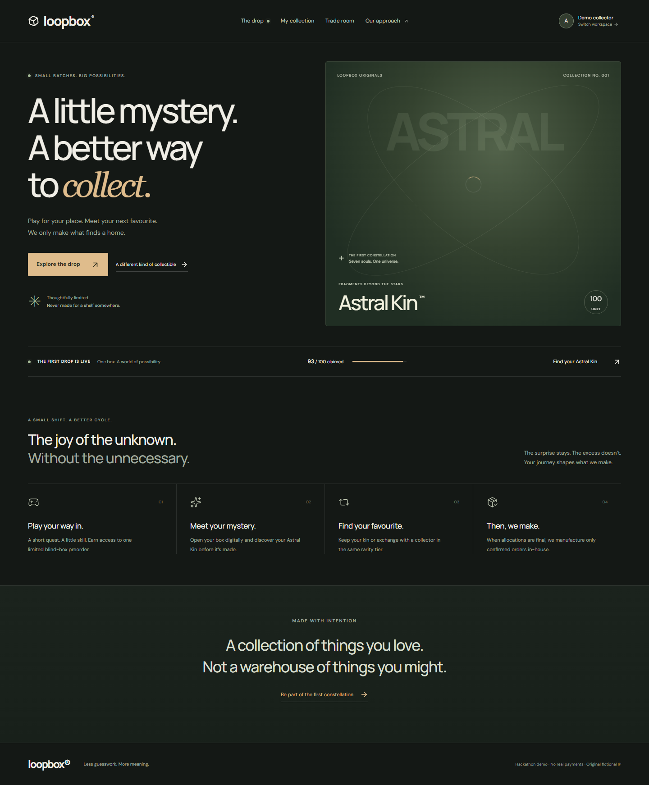

# LoopBox

**A little mystery. A better way to collect.** LoopBox is a demo of demand-aware collectible commerce. Collectors earn blind-box preorder access by completing a branded quest, digitally discover their allocation, and can make a same-rarity exchange before the series is manufactured. The business sees a production plan derived from confirmed orders.

This is a **single-host hackathon prototype** with fictional original IP. Checkout and demo identities are simulated. It is not a live store.



## Problem

The typical collectible cycle forecasts demand, manufactures inventory, then discovers what people actually want. Blind-box trading after shipping adds unnecessary movement. LoopBox moves allocation and trading ahead of manufacturing. It makes no numerical carbon-savings claim.

## Solution and product lifecycle

`Create limited series → Set cap → Play quest → Earn access → Confirm demo preorder → Receive one digital blind box → Open → Keep or exchange with another collector in the same rarity tier → Lock final ownership → Manufacture confirmed quantities in-house → Ship`

The demo campaign is **Astral Kin — Fragments Beyond the Stars**. It starts with 93 of 100 preorders, costs SGD $18.90 per box, and allows at most two paid boxes per collector. Seven original characters have common, rare, and secret tiers. There is no way to buy a guaranteed character.

## Core features

- Editorial storefront, responsive campaign page, production cap, rarity lineup, account purchase limit, and waitlist for sold-out state.
- Configurable 30-second fragment run with keyboard and touch controls, hazard avoidance, pause, score, retry, and a one-use server game session. The untimed, three-question lore challenge grants the same access.
- Server-issued, 15-minute preorder access. Demo checkout redeems it in a SQLite `BEGIN IMMEDIATE` transaction, applies the hard capacity cap and per-user limit, and creates exactly one order and allocation.
- Three.js / React Three Fiber character and box geometry, lazy-loaded WebGL stage, animated digital reveal, reduced-motion support, and a static fallback. Revisiting the reveal cannot reroll the allocation.
- Collection, duplicate detection, downloadable social card, same-rarity trade preferences, deterministic reciprocal match, consent and decline, and final ownership updates.
- Studio campaign settings, phase advancement, meaningful demand figures, allocation table, CSV plan, and production lock. Final production quantity comes from confirmed allocations.

## Architecture

Next.js App Router and React 19 provide the interface. TypeScript and Zod validate API input. The `src/server/service.ts` domain service owns business rules. Node's built-in SQLite library stores data in `data/loopbox.sqlite` by default; schema, indexes, foreign keys, unique constraints, and a database capacity trigger are defined in `src/server/schema.ts`. Session tokens are random and stored in HTTP-only, SameSite cookies. The seeded quick accounts are for the demo only. `DEMO_MODE=false` disables those accounts; production authentication has not been implemented.

Routes: `/` discovery, `/drop` campaign, `/quest` game, `/checkout` simulated checkout, `/reveal/[id]` digital reveal, `/collection`, `/trades`, and `/studio`. `/api/loopbox` is the validated JSON boundary. UI components never grant entitlements or alter ownership directly. `ARCHITECTURE.md` records the inspection and design decisions.

### Database model

Businesses, users, campaigns, characters, sessions, game sessions, preorder access, orders, allocations, trade preferences, matches, and waitlist entries are related by foreign keys. Orders have unique access IDs; allocations have unique order IDs. The trigger blocks inserts above campaign capacity, even if application logic is bypassed. Indexes cover orders, entitlements, ownership, preference lookup, and matches. Reinitializing from an empty SQLite file seeds 93 historical orders and allocations; they represent demo data, not actual purchases.

### Matching and digital allocation

Demo checkout deterministically allocates **Eclipse Knight** so the walkthrough is repeatable. Non-demo allocation uses configurable weights, but there is no production checkout. Each allocation belongs to one immutable order. Reveal only marks it opened. Matching searches an available allocation from another owner, in the same campaign and rarity, whose owner wants the offered character and whose character is wanted by the requester. Both allocations are reserved atomically. Both collectors must accept before the two owner IDs swap. Sarah's seeded demo listing has simulated consent, disclosed in the UI. Pending matches expire at production lock. The plan counts the character IDs of all final allocations; trades change ownership without creating units.

### Game and 3D reveal

`src/lib/catalog.ts` defines the quest duration, waves, score target, visuals, and access reward. The fragment-run trajectory is submitted to a one-use server session. The server calculates its score from the generated lane pattern and validates elapsed time and wave count. This is plausible-run validation for a demo, **not authoritative anti-cheat** against a scripted client. The lore route is motor-accessible and server-graded. The 3D stage loads separately from the initial page bundle. It uses generated low-poly geometry, capped device pixel ratio, restrained lights, and a still-art fallback when WebGL is unavailable.

## Setup and environment

Requires **Node 24 or newer** and npm. No external credentials are needed.

```bash
npm ci
cp .env.example .env.local # optional; on Windows use Copy-Item
npm run dev
```

Open `http://127.0.0.1:3000`. The database is created on first request. `LOOPBOX_DB` overrides its location; the server needs a persistent writable disk. `DEMO_MODE=true` enables seeded collector and studio switching. `.env.example` contains the complete environment template. There are no payment, Supabase, AI, or analytics service keys.

## Demo accounts and walkthrough

Use the top-right switcher for **Alex / Demo collector** and **Astral Studio / Demo studio**. Sarah is a seeded matching partner, accessible only through the demo scenario. Fresh data starts at 93 / 100.

1. Open `/`, enter Astral Kin, and inspect capacity, price, and rarity lineup.
2. Select **Play to unlock**. Complete the fragment run or the untimed lore challenge.
3. Claim the earned slot and confirm the **demo** preorder. No money or card data is collected.
4. Open the allocated box. The new kin is **Eclipse Knight · Rare**, making a duplicate of Alex's seeded Eclipse Knight.
5. Select **Find a trade**, choose **Aurora Warden · Rare**, and accept Sarah's reciprocal match.
6. Refresh `/collection` to see persistent Aurora Warden ownership.
7. Switch to `/studio`; inspect confirmed orders and demand, then advance through **Preorder closed → Trade window → Allocation locked**. The final manufacturing plan totals 94 units in this path.

For a repeatable run, stop the server and run `npm run reset:demo` (it removes only the generated `data/loopbox.sqlite` and related `-wal`/`-shm` files). Restart the app. This deletes local demo progress.

## Payments (Stripe test mode)

Checkout uses Stripe Checkout in **test mode only**; live keys (`sk_live_…`) are refused. A box is allocated only after a signed, de-duplicated `checkout.session.completed` webhook. The success page never allocates; it waits for the server.

- **No keys (default demo):** with `DEMO_MODE=true` and `STRIPE_SECRET_KEY` empty, "Pay with card" runs a simulated payment through the same webhook handler. The page says "Simulated payment (demo)".
- **Real test payments on your laptop:**
  1. Put your test key in `.env.local`: `STRIPE_SECRET_KEY=sk_test_...` (server-only, never `NEXT_PUBLIC_`).
  2. `stripe login`, then `stripe listen --forward-to 127.0.0.1:3000/api/stripe/webhook`.
  3. Copy the `whsec_...` it prints into `.env.local` as `STRIPE_WEBHOOK_SECRET`, then restart `npm run dev`.
  4. Pay with card `4242 4242 4242 4242`, any future expiry date, any CVC. The Stripe CLI prints `checkout.session.completed` and `[200]`.
- **Safety rails:** Stripe needs a Checkout Session to live at least 30 minutes, so an unpaid order holds its seat for 31 minutes, then expires (Stripe's `checkout.session.expired` webhook, or lazily on the next page load). A payment that arrives after its seat was given away is refunded automatically. `MAX_CHARGE_CENTS` (default `100000`, S$1,000) caps any single charge.
- **If the webhook can't reach you during a demo:** with `SIMULATE_PAYMENTS=true` the waiting page offers "Simulate payment (demo)" after 60 seconds.

## Deploy (single host)

LoopBox stores everything in one SQLite file, so it must run on **one Node 24 server with a persistent disk**. Do not deploy it to Vercel or any serverless platform: every write would be lost.

- **Runtime:** Node 24 or newer.
- **Disk:** mount a persistent volume at `data/` (or point `LOOPBOX_DB` at a file on the volume).
- **Environment:** copy the variables from `.env.example` into the host's settings. Set `HOSTNAME=0.0.0.0` so the server accepts outside traffic. The host's `PORT` variable is respected.
- **Build and start:** `npm ci && npm run build`, then `npm start`.
- **Health check:** `GET /api/health` returns `{"ok":true,"db":true,"demo":true}` when the database opens.

`npm start` binds to `127.0.0.1` unless `HOSTNAME` is set, so a laptop demo is never exposed to the local network by accident. The laptop (`npm run build && npm start`) is always the backup if the host is down.

## Testing

```bash
npm run typecheck
npm run lint
npm test
npm run build
npm run test:e2e
```

`tests/domain.test.ts` checks entitlement uniqueness, losing and winning quests, access reuse and expiry, per-user and campaign caps, cross-user access, same-rarity enforcement, reciprocal matching, both consents, trade rejection, production locking, and plan totals. Playwright uses a separate seeded SQLite file and installed Chrome. Its browser tests cover the complete golden path, 30-second keyboard game with pause, last-unit concurrent API requests, role and origin guards, 375px layout, reduced motion, WebGL fallback, and WCAG A/AA axe checks on the primary collector pages. It captures review screenshots in the parent task's `work/qa/` folder. Some locked-down machines may require `npx playwright install chromium` or a local Chrome installation.

## Security and sustainability assumptions

The demo uses one-use game sessions and access rows, HTTP-only random session cookies, server ownership checks, request schema validation, same-origin POST checks, foreign keys, transactions, and a database capacity trigger. It does not include production sign-in, rate limiting across hosts, payment settlement, authoritative anti-cheat, or bot protection. The seeded studio identity is deliberately easy to enter and must be disabled for any public deployment.

Confirmed preorder count is the production quantity. “Unmanufactured capacity” is simply cap minus orders, **not a measured amount of waste or carbon saved**. Physical fulfilment is a narrative phase in this prototype; no shipment is placed.

## Working, simulated, future work

**Working:** the local collector journey, server entitlements, capacity guard, persistent SQLite allocations, digital reveal, reciprocal exchange, phase lock, and derived production plan.

**Simulated:** identities, payment, Sarah's acceptance, 93 historical orders, manufacturing, and shipping.

**Future work:** production identity and payment providers, PostgreSQL for deployment across multiple servers, audited game telemetry and anti-cheat, fulfillment integration, campaign creation and multi-brand support, live recipient consent notifications, measured sustainability research, and performance profiling on physical mobile devices.

## Known limitations

- The app edits one seeded campaign; it does not create additional campaigns. The studio is therefore a focused single-series demo.
- SQLite requires a persistent single-host runtime. Serverless or multi-instance hosting requires a database migration.
- Direct reciprocal matching is implemented; three-way cycles are not.
- The 3D guardian is generated geometry with color variants rather than seven separately modelled character assets.
- The game session checks elapsed time and trajectory plausibility but cannot defeat a client that scripts legal lane movements.
